# EBmetro

## Descrizione

Il progetto riguarda la ricostruzione di un **misuratore di campi elettrici e magnetici (EBmetro)** ideato dal Prof. Francesco Dalla Valle.

Lo strumento è stato progettato per rendere **misurabili e osservabili**:

* intensità del campo elettrico e magnetico
* direzione
* verso

con l’obiettivo di fornire un supporto concreto alla comprensione dell’elettromagnetismo.

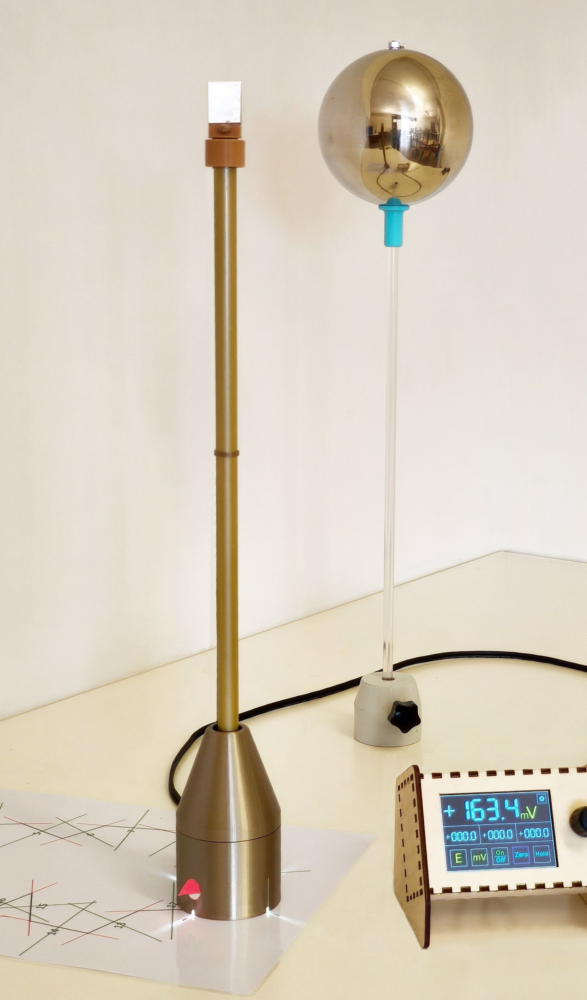

---

## Obiettivo

L’EBmetro permette di verificare sperimentalmente:

* la circuitazione del campo elettrico lungo una linea chiusa
* la circuitazione del campo magnetico
* il fenomeno dell’induzione elettromagnetica

rendendo osservabili in modo diretto le prime tre equazioni di Maxwell.

---

## Struttura della repository

### /3D Model

Contiene i modelli dei case utilizzati per ospitare il microcontrollore e la scheda di acquisizione.

Sono presenti due principali varianti:

* versione per stampa 3D
* versione per taglio laser

La versione realizzata tramite intaglio laser consente una produzione più rapida e semplificata.

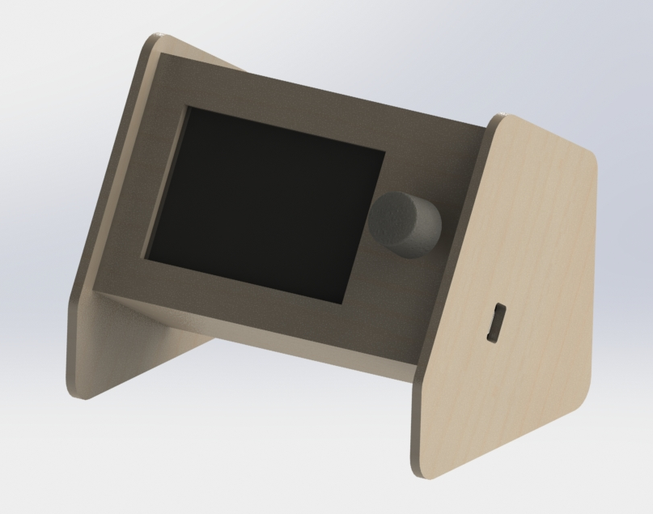 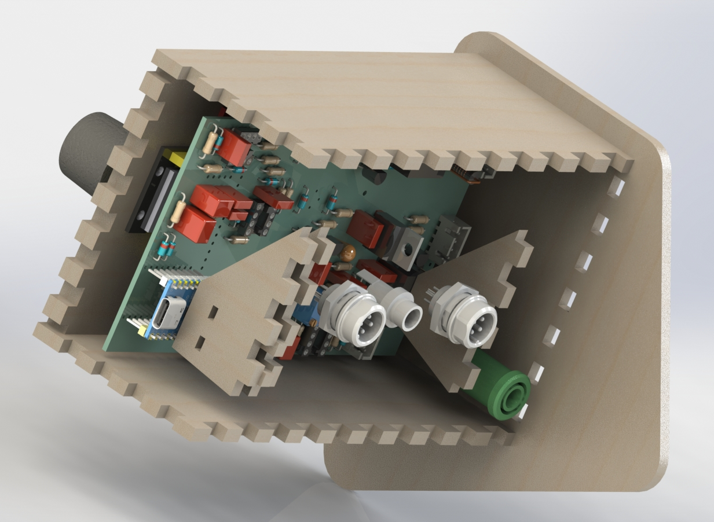

---

### /EBmetro

Contiene l’implementazione completa del dispositivo:

* schemi elettronici
* PCB
* firmware

Dove sono presenti le schede per l'EBmetro e per la base dell'EBmetro.

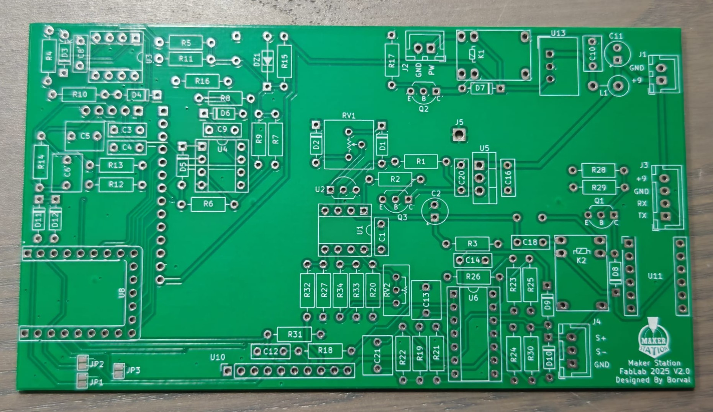 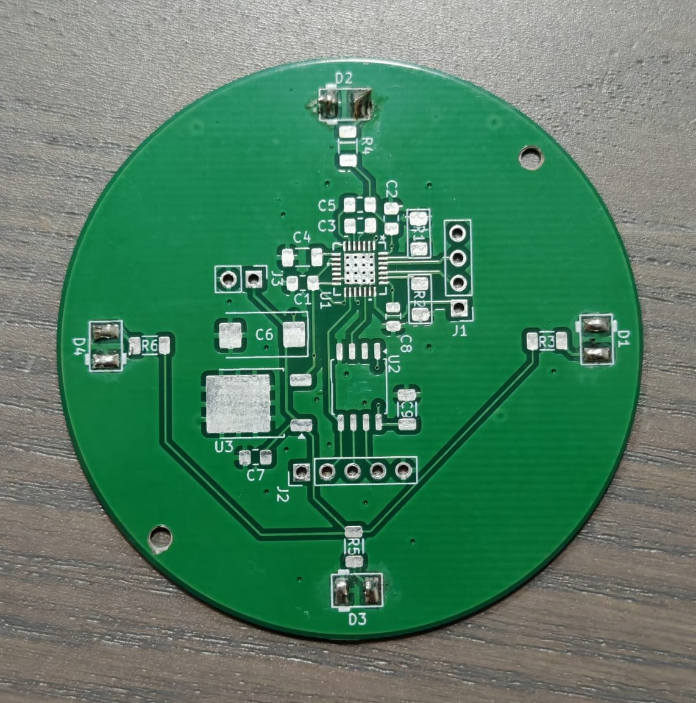

---

### /generatore

Contiene lo sviluppo di un generatore di rampe di corrente:

* schema elettronico
* firmware

Il generatore è in grado di fornire correnti fino a 30 A ed è utilizzato per pilotare bobine di Helmholtz.
Questo consente di generare campi magnetici controllati e misurare, tramite il sensore (“manico”), l’andamento della corrente indotta in un avvolgimento di dimensioni variabili.

---

## Descrizione del funzionamento

Il dispositivo consente la misura del campo elettrico o magnetico in funzione:

* della testina installata
* delle impostazioni software

L’elemento principale è una **testina rotante** dotata di contatti in oro, che ruota sul proprio asse.

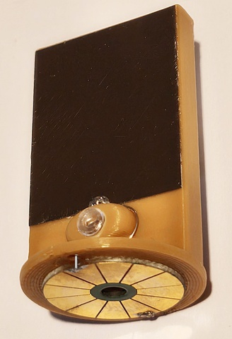 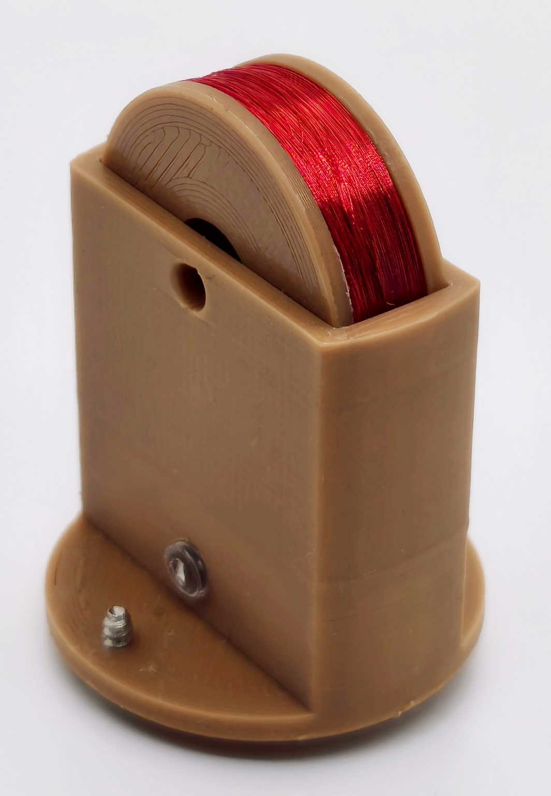 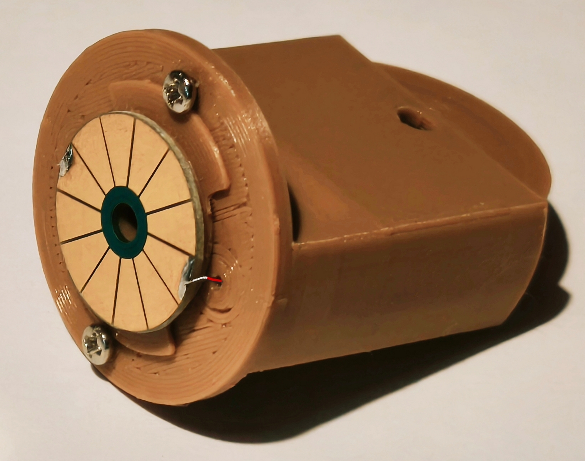

I contatti sono stati realizzati tramite PCB, HASL con placcatura.

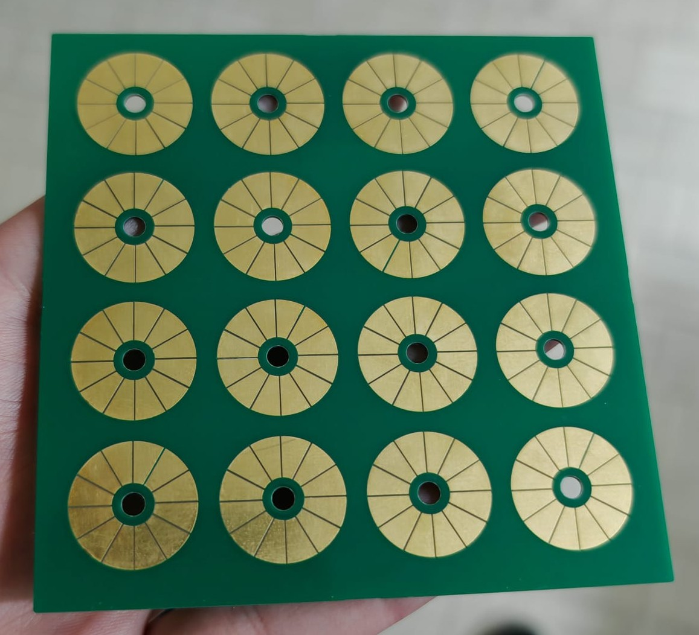

Durante la rotazione, la testina entra in contatto con due **contatti striscianti**, permettendo l’acquisizione del segnale.

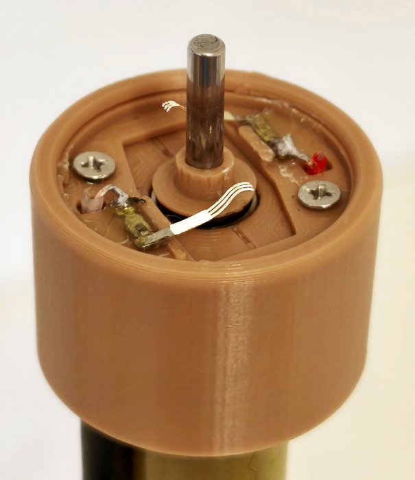

L’elaborazione del segnale avviene in un’unità separata dalla base, al fine di ridurre le interferenze sulla misura.

Nella base dell’EBmetro è possibile integrare:

* un motore brushless
* oppure un motore passo-passo

entrambi controllati da un microcontrollore ATtiny85 posizionato sotto la struttura.

L'EBmetro ha inoltre un Goniometro sulla propria base.

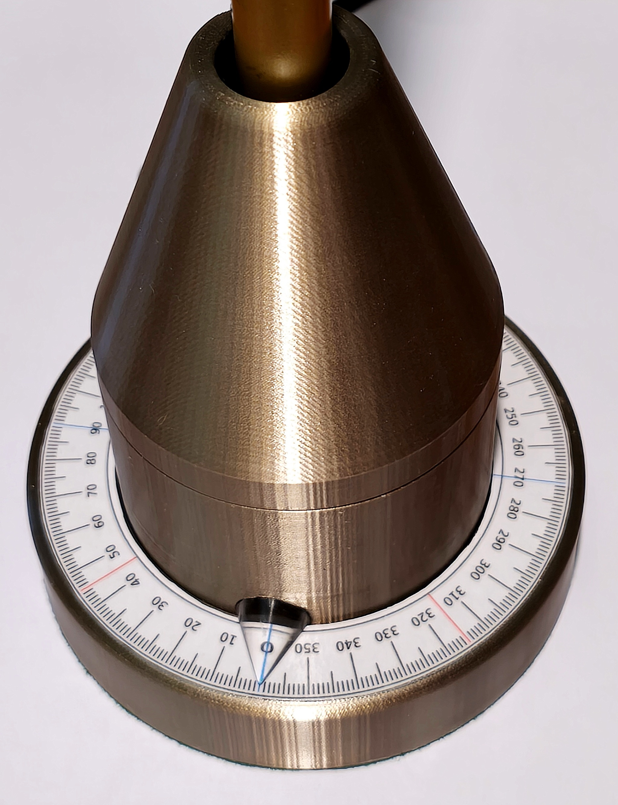
---

## Crediti

Ideato dal:

* Prof. Francesco Dalla Valle
* Prof. Giacomoni
* Prof. Cortesi

Sviluppo di questa versione:

* Enzo Cortesi
* Ing. Valerio Borghi
* FabLab Maker Station Bassa Romagna

---
